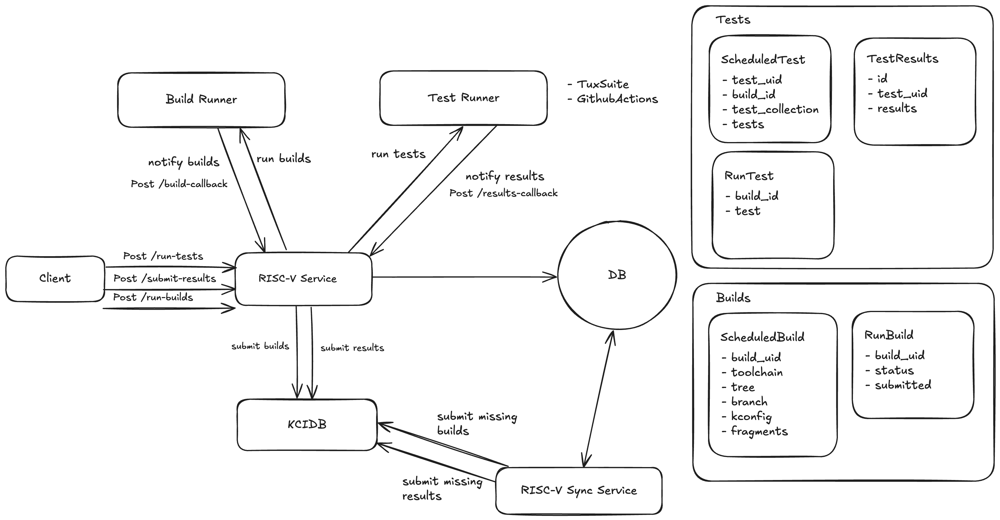

# RISC-V Kernel CI Bridge

You can find a detailed documentation on this project in this link [https://risc-v-kernelci-mentorship.github.io/riscv-kci-bridge/](https://risc-v-kernelci-mentorship.github.io/riscv-kci-bridge/).

## Getting Started

The commands in this documentation can be customized on the **Makefile**. It can be started with and without docker.

This project uses poetry, if you don't have it installed, you can the follow the instruction in [Poetry Documentation](https://python-poetry.org/docs/#installation).

- Run the server (Recommended using docker):

```bash
# Run locally with docker in dev mode and force build
make run-dev-build
# or
# Run locally with docker in dev mode
make run-dev
# or
# Run locally with docker in prod mode (Autorelod disabled)
make run-prod
```

Open [http://fastapi.localhost/docs](http://fastapi.localhost/docs) with your browser to see the result.


- Run the server without docker:

First, make sure you have all packages installed:

```bash
make install
```

```bash
make run-app
```

## Sytem design

Below there is a diagram portraing the design of the system:


